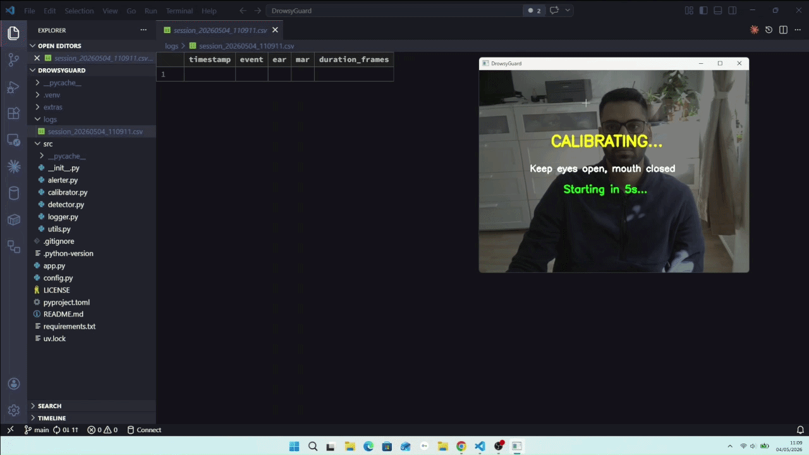
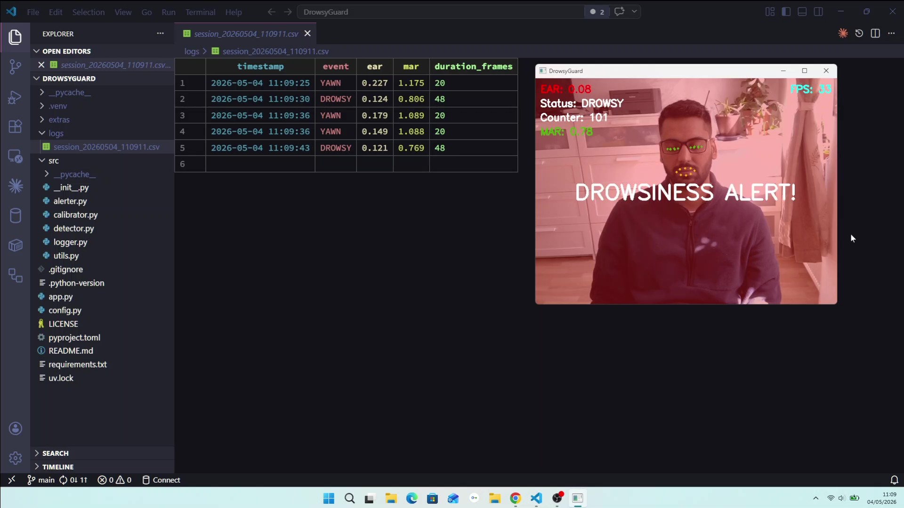

<div align="center">

# DrowsyGuard 👁️
 


 
Real-time driver drowsiness detection using **MediaPipe Face Mesh** and **OpenCV**.  
Detects eye closure and yawning from a webcam feed and triggers alerts before fatigue becomes dangerous.


 
</div>

[Demo](https://drive.google.com/file/d/1N99XT4pOi_pm7FdS_8Fr2l5jwAqpjXcF/view?usp=drive_link) with sound alerts.

## Features
 
- Personal calibration at startup and thresholds adapt to your face automatically
- Eye closure detection using Eye Aspect Ratio (EAR)
- Yawn detection using Mouth Aspect Ratio (MAR)
- Audio alert on drowsiness, visual overlay for both events
- FPS counter displayed on screen
- Session logging with every event saved to CSV with timestamp and metric values
- Runs fully on CPU, no GPU required

## How It Works

MediaPipe Face Mesh detects 468 facial landmarks from each webcam frame. From these landmarks, two geometric ratios are calculated every frame

### Eye Aspect Ratio (EAR)
**Eye Aspect Ratio (EAR)** measures how open the eyes are using 6 points around each eye. When eyes are open the ratio is high (~0.30-0.40). When eyes close the ratio drops (~0.15). If EAR stays below the personal threshold for 48 consecutive frames (~2 seconds), a drowsiness alert fires.

```
EAR = (|P2-P6| + |P3-P5|) / (2 * |P1-P4|)
```

### Mouth Aspect Ratio (MAR)
**Mouth Aspect Ratio (MAR)** applies the same principle to mouth landmarks. A wide open mouth during a yawn pushes the ratio significantly above the resting baseline. If MAR exceeds the personal threshold for 20 consecutive frames, a yawn is detected.

### Calibration
**Calibration** runs at startup for 10 seconds. The app measures your personal EAR and MAR baseline with eyes open and mouth closed, then sets thresholds automatically. No manual tuning needed. This makes detection accurate for every face without manual tuning.

```
EAR threshold = avg_EAR - 0.10
MAR threshold = avg_MAR + 0.25
```

## Project Structure

```
DrowsyGuard/
│
├── src/
│   ├── detector.py       # MediaPipe face mesh, EAR and MAR calculation
│   ├── alerter.py        # audio alert logic
│   ├── calibrator.py     # startup calibration for personal thresholds
│   ├── logger.py         # session event logging to CSV
│   └── utils.py          # overlays and display helpers
│
├── assets/
│   └── demo.gif          # demo recording
│
├── logs/                 # auto-created, stores session CSV files
├── app.py                # main entry point and webcam loop
├── config.py             # landmark indices and frame count thresholds
├── requirements.txt
├── pyproject.toml
└── README.md
```

## Tech Stack

| Tool | Purpose |
|---|---|
| MediaPipe 0.10.14 | Face mesh — 468 landmark detection |
| OpenCV 4.13 | Webcam capture, frame processing, drawing |
| NumPy | EAR/MAR geometric calculations |
| Pygame | Audio alert generation |
| Python 3.12 | Runtime |

## Installation

```bash
git clone https://github.com/harmandeep2993/DrowsyGuard.git
cd DrowsyGuard

uv venv --python 3.12
.venv\Scripts\activate         # Windows
source .venv/bin/activate      # macOS/Linux

uv pip install -r requirements.txt
```


## Usage
 
```bash
python app.py
```
 
Keep eyes open and mouth closed during the 10-second calibration screen. Detection starts automatically after calibration. Press `q` or `ctrl+C` to quit
 
## Alerts
| Event | Visual | Audio |
|---|---|---|
| Drowsiness | Red screen overlay | Beep, loops until eyes open |
| Yawning | Orange screen overlay | None |


 
## Limitations
- Requires good lighting, no IR camera support
- Single face detection only
- Calibration is session-based and recalibrates on every run
- Not validated for production safety use

## Why This Project
Drowsy driving causes approximately 20% of fatal road accidents in Europe. Companies like Bosch, Continental, and BMW build driver monitoring systems using exactly this approach and face landmark detection combined with geometric ratio algorithms. This project demonstrates how MediaPipe face mesh can serve as the foundation for a real-time safety-critical computer vision application.
 
## License
MIT © 2026 Harmandeep Singh
